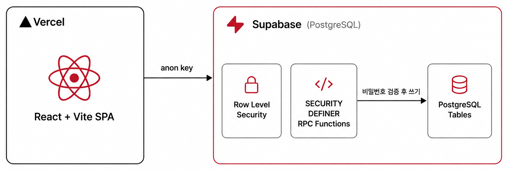
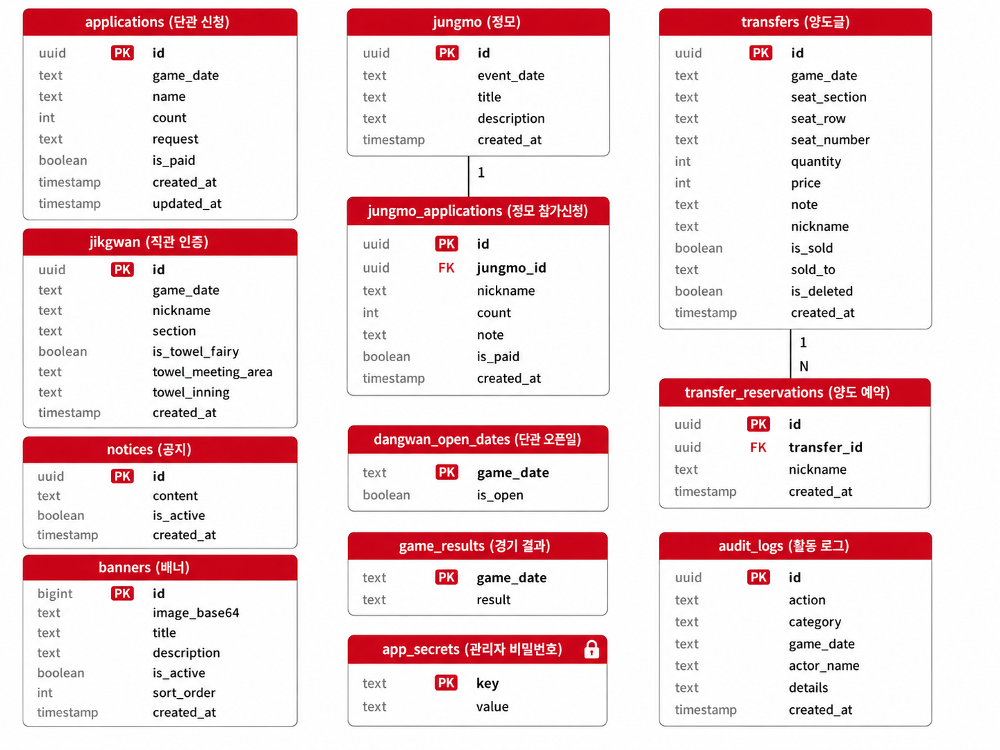

<!-- HEADER -->
<div align="center">


### ⚾ 엘고리즘 — LG 트윈스 팬 커뮤니티 통합 관리 웹앱

경기 일정 확인부터 단관 신청 · 직관 인증 · 정모 · 양도게시판까지, 팬 커뮤니티 운영에 필요한 걸 한 곳에서.

<br/>

[](https://lgorism.vercel.app)
[](https://lgorism.vercel.app)

</div>

<br/>

## 💡 제작 배경

원래는 단체관람 인원을 단톡방 투표로 모으고, 투표 기한이 끝나면 놓친 사람들 신청을 댓글로 또 받는 방식으로 운영되고 있었습니다.

- 투표 + 댓글로 나뉘어 들어오다 보니 **신청자를 놓치는 경우**가 생기고
- 누가 입금했는지 **일일이 대화 내역을 다시 찾아 확인**해야 해서 번거로웠습니다.

이 과정을 한눈에 보이게 정리하고 싶어서, 신청·입금 여부·직관 인증·정모까지 한 곳에서 관리할 수 있는 웹앱을 만들게 됐습니다.

<br/>

## 🛠️ Tech Stack

<div align="center">


</div>

<br/>

| 분류 | 기술 |
|------|------|
| **Frontend** | React 18 + Vite 5 |
| **Icons** | react-icons (Font Awesome) |
| **Database / BaaS** | Supabase (PostgreSQL, RLS, RPC) |
| **인증/권한 검증** | Postgres `SECURITY DEFINER` 함수 (pgcrypto) |
| **배포** | Vercel (정적 SPA 빌드) |
| **분석** | Google Analytics 4 (프로덕션 빌드에서만 로드) |

> 백엔드 서버 없이 React SPA가 Supabase와 직접 통신하는 구조이며, 권한이 필요한 모든 쓰기 작업은 아래 [보안](#-보안) 섹션에서 설명하는 서버 사이드 RPC를 통해서만 이루어집니다.

<br/>

## 🏗️ 아키텍처

<div align="center">
  
</div>

<br/>

## 🗂️ ERD

<div align="center">
  
</div>

<br/>

## ✨ 주요 기능

<details open>
<summary><b>🏠 홈</b></summary>

<br/>

| 영역 | 기능 |
|------|------|
| **히어로 슬라이더** | 관리자가 등록한 배너 이미지가 자동으로 넘어가며 노출 (드래그로 순서 변경) |
| **공지 배너** | 관리자가 등록한 공지사항 표시, 개별 닫기 가능 |
| **단체관람 승률** | 단관 참여 경기의 승/패/무 집계 |
| **오늘의 경기 카드** | 홈/원정, 상대팀, 시간, 구장 정보 · 오늘 경기가 없으면 다음 경기 안내 |
| **퀵 액션** | 단관신청 · 정모 · 양도 바로가기 |

</details>

<details open>
<summary><b>📅 경기 일정 달력</b></summary>

<br/>

- 2026 시즌 LG 트윈스 전체 경기 일정 표시 (홈 / 원정 구분)
- 날짜별 단관 신청자 수 · 직관 인증 수 · 정모 수 뱃지 표시
- 필터 칩으로 전체 / 정모 / 단관 뷰 전환

</details>

<details open>
<summary><b>📋 단관 신청</b></summary>

<br/>

- 관리자가 오픈한 날짜에만 신청 가능
- 닉네임 · 인원 · 특이사항 · 비밀번호 입력, 비밀번호 인증 기반 수정 · 삭제
- 지난 경기 자동 마감 처리

</details>

<details open>
<summary><b>🏟 직관 인증</b></summary>

<br/>

- 날짜별 직관 멤버 등록 (닉네임 · 구역 · 수건 요정 여부 및 집합 시간·장소)
- 비밀번호 인증 기반 수정 · 삭제

</details>

<details open>
<summary><b>🎮 정모</b></summary>

<br/>

- 날짜별 정모 이벤트 생성 (제목 · 설명 · 비밀번호)
- 정모별 참가 신청 (닉네임 · 인원 · 메모), 참가자 정산 계산기 포함
- 전체 정모 목록 한눈에 보기 (오늘 이후 기준)

</details>

<details open>
<summary><b>🎫 양도게시판</b></summary>

<br/>

- 좌석 구역·열·번호, 매수, 가격, 설명을 포함한 양도글 등록
- 예약(선착순 관심 표시) · 양도완료 처리 · 비밀번호 인증 기반 삭제
- 잠실야구장 좌석 시야 확인 사이트로 바로가기 링크

</details>

<details open>
<summary><b>🛡 관리자 페이지</b></summary>

<br/>

헤더 로고 5번 탭 → 관리자 비밀번호 입력으로 진입

| 탭 | 기능 |
|----|------|
| **로그** | 단관·직관·정모·양도 등록/수정/삭제/입금 이력 (카테고리·액션별 필터) |
| **입금** | 단관·정모 신청자 입금 여부 토글 |
| **단관** | 홈 경기 날짜별 단관 오픈 / 마감 |
| **공지** | 공지 등록 · 수정 · 게시중단 · 삭제 |
| **결과** | 단관 오픈 경기의 승/패/무 기록 (승률 계산에 반영) |
| **배너** | 홈 히어로 슬라이더 배너 이미지 업로드(WebP 자동 변환) · 순서 드래그 변경 · 게시중단 · 삭제 |

</details>

<br/>

## 🔒 보안

이 프로젝트는 서버 없이 SPA가 Supabase(anon key)로 직접 통신하는 구조라, **DB 자체가 권한 검증의 최종 방어선**이 되도록 설계했습니다.

| 항목 | 조치 |
|------|------|
| **관리자 인증** | 비밀번호를 클라이언트에 절대 내려보내지 않음 — 해시를 RLS로 잠긴 테이블에 저장하고, `SECURITY DEFINER` RPC(`verify_admin_password`)가 서버에서만 비교 후 boolean만 반환 |
| **글 수정/삭제 권한** | 단관·직관·정모·양도 등 모든 비밀번호 기반 수정/삭제를 클라이언트 비교가 아닌 Postgres RPC에서 검증·처리 (요청·응답 왕복 중 위조 불가) |
| **Row Level Security** | 전 테이블 RLS 활성화. 공개 게시판은 조회·등록(insert)만 허용하고, 수정/삭제는 RPC를 통해서만 가능 (직접 API 호출로 우회 불가) |
| **컬럼 단위 권한 분리** | `password` 컬럼은 select 권한에서 완전히 제외 — 목록 조회 API 응답 자체에 비밀번호 해시가 포함되지 않음 |
| **비밀번호 저장** | SHA-256 해시 저장, 레거시 평문 데이터는 다음 로그인 시 자동으로 해시로 마이그레이션 |
| **관리자 강제 조치** | 양도글 삭제는 작성자 비밀번호 또는 관리자 비밀번호 둘 다 허용 (관리자 비밀번호는 여전히 서버에서만 검증되므로 별도 노출 경로 없음) |

> 이전에는 관리자 비밀번호가 빌드된 JS 번들에 평문으로 포함되어 있었고, 그 값이 모든 글의 비밀번호를 우회하는 마스터 키로도 쓰이던 취약점이 있었습니다. 이를 발견해 위와 같이 서버 사이드 검증 구조로 전면 개편했습니다.

<br/>

## 📁 프로젝트 구조

```
LGorism/
├── frontend/                          # React 앱 (실제 서비스, Vercel 배포 대상)
│   ├── index.html
│   ├── vite.config.js
│   ├── package.json
│   └── src/
│       ├── main.jsx                   # 진입점
│       ├── App.jsx                    # 루트 컴포넌트 + 전체 상태 관리
│       ├── components/
│       │   ├── HomeView.jsx           # 홈 화면
│       │   ├── HeroSlider.jsx         # 히어로 배너 슬라이더 (DB 기반)
│       │   ├── NoticeBanner.jsx       # 공지 배너
│       │   ├── WinRate.jsx            # 단체관람 승률
│       │   ├── Calendar.jsx           # 경기 일정 달력 (뱃지 포함)
│       │   ├── GameCard.jsx           # 선택된 날짜의 경기 정보 카드
│       │   ├── ApplicationForm.jsx    # 단관 신청 폼 (신규·수정 겸용)
│       │   ├── ApplicationList.jsx    # 단관 신청 목록
│       │   ├── DangwanDateList.jsx    # 단관 오픈 날짜 목록 (필터 뷰)
│       │   ├── JikgwanPanel.jsx       # 직관 등록 + 목록
│       │   ├── JungmoPanel.jsx        # 정모 생성 + 참가 신청
│       │   ├── JungmoSettlement.jsx   # 정모 정산 계산기
│       │   ├── AllJungmoList.jsx      # 전체 정모 목록 (필터 뷰)
│       │   ├── TransferBoard.jsx      # 양도게시판 목록 + 등록 폼
│       │   ├── TransferCard.jsx       # 양도글 카드 (예약·완료처리·삭제)
│       │   ├── AdminPage.jsx          # 관리자 페이지
│       │   └── BottomNav.jsx          # 하단 탭 네비게이션
│       ├── data/
│       │   └── games.js               # 2026 시즌 경기 일정 정적 데이터
│       └── utils/
│           ├── supabase.js            # Supabase 클라이언트 초기화
│           ├── storage.js             # 전체 DB CRUD + RPC 호출 함수
│           ├── image.js               # 업로드 이미지 리사이즈 + WebP 변환
│           └── analytics.js           # GA4 이벤트 트래킹
└── src/                                # Spring Boot 스캐폴딩 (미사용, 배포 대상 아님)
    └── main/java/com/back/
        └── LGorismApplication.java
```

<br/>

## 🗄️ 데이터베이스 구조 (요약)

| 테이블 | 용도 |
|--------|------|
| `applications` | 단관 신청 |
| `jikgwan` | 직관 인증 |
| `jungmo` / `jungmo_applications` | 정모 / 정모 참가 신청 |
| `transfers` / `transfer_reservations` | 양도글 / 양도 예약 |
| `notices` | 공지사항 |
| `banners` | 홈 히어로 슬라이더 배너 |
| `dangwan_open_dates` | 단관 오픈 날짜 |
| `game_results` | 경기 결과 (승/패/무) |
| `audit_logs` | 활동 로그 |
| `app_secrets` | 관리자 비밀번호 해시 (RLS로 완전히 잠김, RPC만 접근 가능) |

수정/삭제가 필요한 테이블에는 각각 대응하는 `rpc_*` / `rpc_admin_*` 함수가 있으며, 클라이언트는 테이블을 직접 수정하지 않고 이 함수들만 호출합니다.

<br/>

## ⚙️ 로컬 실행

**1. 환경 변수 설정** — `frontend/.env.local`

```env
VITE_SUPABASE_URL=https://your-project.supabase.co
VITE_SUPABASE_ANON_KEY=your-anon-key
```

**2. 의존성 설치 및 실행**

```bash
cd frontend
npm install
npm run dev
```

**3. 빌드 및 미리보기**

```bash
npm run build
npm run preview
```

> Supabase 프로젝트에는 각 테이블의 RLS 정책과 `rpc_*` 함수들이 미리 설정되어 있어야 정상 동작합니다.

<br/>

## 🌿 브랜치 전략

```
main  ← 바로 커밋 (1인 개발, 기능 단위로 작게 커밋)
```

<br/>

<!-- FOOTER -->
<div align="center">


</div>
